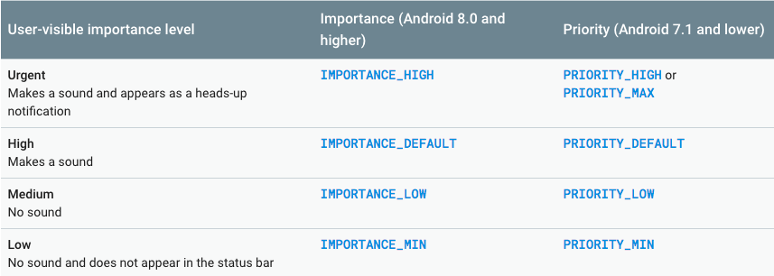

===========================================
Notification
===========================================

*********
Contents
*********

* What is a Notification ?
* Why is a Notification ?
* History of Notification
* How is a Notification ?

************************
What is a Notification ?
************************
A notification is a message your app displays to the user outside your app's normal UI. When your app tells the system to issue a notification, the notification appears to the user as an icon in the notification area, on the left side of the status bar.

.. image:: notify.png
    :width: 200px
    :align: center
    :height: 100px
    :alt: alternate text
    
************************
Why is a Notification ?
************************ 
- To notify the user if there is trigger of the data from the background services.
- It let the user to know about the messages or any updates about the applications along with the actions.
- User may know about the triggers without going into the application.
- Also will send the live changes like temperature ,time ,date and location.

    
************************
History of Notification
************************ 

- This Notifications are started from the android version 4.4 (Kitkat).
- For every new version released there is a much evaluation in the design,style,text ,icons for the notification.
- It becomes more effective and efficient for the user to work with it.
- Now it is also coming with the notifications dots to make use have the fast interaction with the applications easily.

    
************************
How of Notification
************************

- In the versions upto Android 7 (Nougat) we can drag the notification from the top of the screen.
- In the latest versions  of android notification dots are introduced by clicking on it we can view the data trigger from applciation.
- Notification is created and build using the Notification Service,Notification Manager and Notification Compat.
- Upto Android version 7 (Nougat) all this tools are same but from the Android version 8 (Oreo) a new built in tool is introduced and named as Notification Channel under the Android Jetpack Components.

*****************************
Creating Notification Channel
*****************************

To create a notification channel instance, use the NotificationChannel constructor. Specify an ID that's unique within your package, a user-visible channel name, and an importance for the channel:
::
    
    if (Build.VERSION.SDK_INT >= Build.VERSION_CODES.O) {
        NotificationChannel notificationChannel = 
            new NotificationChannel(CHANNEL_ID, "Mascot Notification",NotificationManager.IMPORTANCE_DEFAULT);
            }

******************************
Imporatance Level and Priority 
******************************

The NotificationChannel constructor, which is available in Android 8.0 (API level 26) and higher, requires an importance level. The channel's importance determines the instrusiveness of the notifications posted in that channel. For example, notifications with a higher importance might make sound and show up in more places than notifications with a lower importance. There are five importance levels, ranging from IMPORTANCE_NONE(0) to IMPORTANCE_HIGH(4).

To support Android 7.1 (API level 25) or lower, you must also set a priority for each notification. To set a priority, use the setPriority() method with a priority constant from the NotificationCompat class.
::

    mBuilder.setPriority(NotificationCompat.PRIORITY_HIGH);

On devices running Android 8.0 and higher, all notifications, regardless of priority and importance level, appear in the notification drawer and as app icon badges. After a notification is created and delivered, the user can change the notification channel's importance level in the Android Settings app. The following table shows how the user-visible importance level maps to the notification-channel importance level and the priority constants.
    

